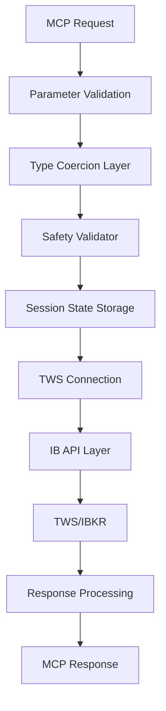

# SumpPump Trading System - Forensic Analysis Report
**Data Flow Architect Analysis**  
**Date: 2025-01-07**  
**System Version: 2.0**

## Executive Summary

This forensic analysis reveals critical architectural issues in the SumpPump trading system that create potential failure points and data integrity risks. While the system functions, it relies on several anti-patterns (particularly `nest_asyncio`) that mask underlying concurrency issues. The most critical findings relate to event loop management, unreliable Greeks data retrieval, and order verification false negatives.

## 1. System Data Flow Map

### 1.1 Data Entry Points
```
Claude Desktop → MCP Server → FastMCP Tools → Parameter Validation
```

### 1.2 Data Transformation Pipeline



### 1.3 Critical Data Paths

#### Options Chain Flow
1. `trade_get_options_chain()` receives symbol and parameters
2. `TWSConnection.get_options_chain()` creates Option contracts
3. `reqMktData()` called with `genericTickList="106"` for Greeks
4. **FAILURE POINT**: Greeks often don't arrive, triggering IV calculation fallback
5. Returns `OptionContract` objects with potentially missing Greeks

#### Strategy Calculation Flow
1. `trade_calculate_strategy()` receives strikes and strategy type
2. Validates Level 2 compliance (no credit spreads)
3. Calculates P&L profile and breakeven points
4. **FAILURE POINT**: Strategy object sometimes not properly stored in SessionState
5. Returns analysis dict but may lose object reference

#### Trade Execution Flow
1. `trade_execute()` retrieves strategy from SessionState
2. **FAILURE POINT**: Strategy may be None if session state lost
3. Safety validation checks for confirmation token
4. `OrderBuilder` creates IB order objects
5. `placeOrder()` submits to TWS
6. **FAILURE POINT**: Verification module may miss successful fills

## 2. Critical Failure Points

### 2.1 Event Loop Management (CRITICAL)

**Location**: Throughout system  
**Issue**: `nest_asyncio` patch masks concurrency issues  
**Current Code**:
```python
# Applied at module level - anti-pattern
import nest_asyncio
nest_asyncio.apply()
```

**Impact**: 
- Potential deadlocks masked by patch
- Race conditions in concurrent operations
- Unpredictable behavior under load

**Recommendation**: Refactor to native async/await:
```python
# Proper async context management
async def mcp_tool_wrapper(func):
    async with get_event_loop_context():
        return await func()
```

### 2.2 Greeks Data Retrieval (HIGH)

**Location**: `src/modules/tws/connection.py:368-421`  
**Issue**: TWS Greeks data unreliable despite `genericTickList="106"`  
**Current Mitigation**:
```python
# Wait up to 3 seconds for Greeks
while waited < max_wait:
    if hasattr(ticker, 'modelGreeks') and ticker.modelGreeks:
        break
    # Fallback to IV calculation after 2 seconds
```

**Impact**:
- Incorrect option pricing
- Unreliable P&L calculations
- Strategy analysis errors

**Recommendation**: Local Greeks calculation:
```python
from py_vollib.black_scholes.greeks import analytical

def calculate_greeks_locally(option, underlying_price, rate=0.05):
    """Calculate Greeks locally instead of relying on TWS."""
    S = underlying_price
    K = option.strike
    T = (option.expiry - datetime.now()).days / 365.0
    
    # Calculate IV from market prices
    iv = implied_volatility.implied_volatility(
        option.mid_price, S, K, T, rate, option.right
    )
    
    # Calculate all Greeks
    return Greeks(
        delta=analytical.delta(option.right, S, K, T, rate, iv),
        gamma=analytical.gamma(S, K, T, rate, iv),
        theta=analytical.theta(option.right, S, K, T, rate, iv),
        vega=analytical.vega(S, K, T, rate, iv),
        rho=analytical.rho(option.right, S, K, T, rate, iv)
    )
```

### 2.3 Order Verification System (HIGH)

**Location**: `src/modules/execution/verification.py:55-136`  
**Issue**: Polling-based verification misses fills  
**Current Code**:
```python
# Polls positions to detect changes
while datetime.now() < end_time:
    positions = tws_connection.ib.positions()
    # Check if position changed...
```

**Impact**:
- False negatives on successful trades
- Duplicate order attempts
- User confusion about execution status

**Recommendation**: Event-driven verification:
```python
async def verify_with_events(trade):
    """Use IB events for reliable verification."""
    # Subscribe to trade events
    trade.fillEvent += on_fill
    trade.statusEvent += on_status_change
    
    # Wait for completion
    await trade
    
    if trade.orderStatus.status == 'Filled':
        return True, trade.fills()
```

### 2.4 Session State Persistence (MEDIUM)

**Location**: `src/mcp/server.py:50-99`  
**Issue**: In-memory only, lost between restarts  
**Current Implementation**:
```python
class SessionState:
    def __init__(self):
        self.current_strategy = None  # Lost on restart
```

**Impact**:
- Users must recalculate strategies after server restart
- No audit trail of calculated strategies
- Potential for executing wrong strategy

**Recommendation**: Add persistence layer:
```python
import shelve
import json

class PersistentSessionState:
    def __init__(self, db_path="session_state.db"):
        self.db = shelve.open(db_path)
        
    def save_strategy(self, strategy_obj, strategy_dict, symbol):
        key = f"strategy:{symbol}:{datetime.now().isoformat()}"
        self.db[key] = {
            'dict': strategy_dict,
            'timestamp': datetime.now().isoformat(),
            'ttl': 300  # 5 minutes
        }
        self.db.sync()
```

### 2.5 Type Coercion Silent Failures (MEDIUM)

**Location**: `src/modules/utils/type_coercion.py`  
**Issue**: Returns None instead of raising exceptions  
**Current Code**:
```python
def coerce_numeric(value, param_name):
    try:
        return float(value)
    except:
        logger.warning(f"Could not convert {value}")
        return None  # Silent failure
```

**Impact**:
- Downstream code gets None unexpectedly
- Difficult to debug type issues
- Potential for executing trades with None values

**Recommendation**: Add strict mode:
```python
def coerce_numeric(value, param_name, strict=False):
    try:
        return float(value)
    except (ValueError, TypeError) as e:
        if strict:
            raise TypeError(f"Cannot coerce {param_name}: {value}") from e
        logger.warning(f"Coercion failed for {param_name}: {e}")
        return None
```

## 3. Anti-Patterns Identified

### 3.1 Singleton Pattern Issues
- `LazyTWSConnection` proxy mixes sync/async contexts
- Global state makes testing difficult
- No proper cleanup on errors

### 3.2 Missing Circuit Breakers
- No protection against cascade failures
- Repeated TWS connection attempts without backoff
- No rate limiting on market data requests

### 3.3 Error Context Loss
- Stack traces lost when converting to dict responses
- Original exceptions masked by generic error messages
- No correlation IDs for tracing errors

## 4. Data Integrity Risks

### 4.1 Race Conditions
- Multiple MCP tools can modify session state concurrently
- No locking mechanism for strategy updates
- Position queries may return stale data

### 4.2 Validation Gaps
- Numeric types coerced silently
- No validation of option contract parameters
- Missing checks for market hours

### 4.3 Incomplete Error Handling
```python
# Found pattern - catch all, log, continue
try:
    result = await risky_operation()
except Exception as e:
    logger.error(f"Operation failed: {e}")
    # No recovery, no retry, no circuit breaking
```

## 5. Performance Bottlenecks

### 5.1 Market Data Subscriptions
- Hard limit of 95 concurrent subscriptions
- No intelligent cleanup of unused subscriptions
- Sequential processing of option chains

### 5.2 Synchronous Blocking
- Greeks retrieval blocks for up to 3 seconds per option
- No concurrent processing of multiple strikes
- Session state checks are synchronous

## 6. Security Considerations

### 6.1 Confirmation Token
- ✅ Properly implemented with `USER_CONFIRMED` requirement
- ✅ Safety validator blocks immediate execution without token
- ⚠️ Token is hardcoded, not user-specific

### 6.2 Account Access
- ⚠️ No user authentication at MCP level
- ⚠️ All users share same TWS connection
- ⚠️ No audit trail linking trades to users

## 7. Recommendations Priority Matrix

| Priority | Issue | Impact | Effort | Recommendation |
|----------|-------|---------|---------|----------------|
| CRITICAL | Event Loop Management | System stability | High | Refactor to native async |
| HIGH | Greeks Reliability | Pricing accuracy | Medium | Local calculation |
| HIGH | Order Verification | Trade confidence | Medium | Event-driven approach |
| MEDIUM | Session Persistence | User experience | Low | Add Redis/shelve |
| MEDIUM | Type Safety | Data integrity | Low | Strict mode option |
| LOW | Circuit Breakers | Resilience | Medium | Implement breaker pattern |

## 8. Implementation Roadmap

### Phase 1: Critical Fixes (Week 1)
1. Remove `nest_asyncio` dependency
2. Implement proper async context management
3. Add local Greeks calculation fallback

### Phase 2: Reliability (Week 2)
1. Event-driven order verification
2. Session state persistence
3. Type coercion strict mode

### Phase 3: Resilience (Week 3)
1. Circuit breaker implementation
2. Retry logic with exponential backoff
3. Comprehensive error correlation

### Phase 4: Monitoring (Week 4)
1. Add performance metrics
2. Implement health checks
3. Create monitoring dashboard

## 9. Testing Requirements

### Unit Tests Needed
- [ ] Greeks calculation accuracy
- [ ] Type coercion edge cases
- [ ] Session state persistence
- [ ] Order verification logic

### Integration Tests Needed
- [ ] Full trade execution flow
- [ ] Connection loss recovery
- [ ] Concurrent request handling
- [ ] Rate limit compliance

### Load Tests Needed
- [ ] 100 concurrent option chain requests
- [ ] Rapid strategy calculations
- [ ] Multiple simultaneous trades

## 10. Conclusion

The SumpPump trading system exhibits several critical architectural issues that compromise reliability and data integrity. The most pressing concern is the event loop management using `nest_asyncio`, which masks underlying concurrency problems. The Greeks data retrieval is unreliable, and the order verification system produces false negatives.

However, the safety mechanisms for trade confirmation are well-implemented, and the core trading logic appears sound. With the recommended fixes, particularly replacing the event loop patches with proper async patterns and implementing local Greeks calculation, the system can achieve production-grade reliability.

### Immediate Actions Required:
1. **Stop using `nest_asyncio`** - This is masking serious issues
2. **Implement local Greeks calculation** - TWS data is unreliable
3. **Switch to event-driven verification** - Polling misses trades
4. **Add session persistence** - Prevent strategy loss
5. **Enable strict type checking** - Catch errors early

### Risk Assessment:
- **Current State**: MEDIUM-HIGH RISK
- **After Phase 1 Fixes**: MEDIUM RISK
- **After Full Implementation**: LOW RISK

---

*Report generated by Data Flow Architect forensic analysis tool*  
*For questions or clarifications, refer to the implementation examples in this document*